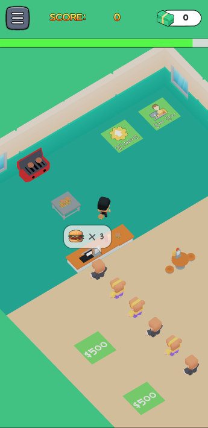

# 🌟 버거 플리즈 재해석 모작
    
**슈퍼센트**사의 타이쿤 캐주얼 게임인 **버거플리즈**를 시간제한형 하이스코어 기록 게임으로 재해석하여 모작한 게임 프로젝트 입니다.
자세한 내용은 아래 링크 항목에 있는 노션에 정리한 내용을 봐주시면 감사하겠습니다.
    

# 🔗링크들
[🔗유튜브 영상](https://youtu.be/cXNBTtTu5Lk)    
[🔗노션](https://thread-atmosphere-8b0.notion.site/1c24ca5dc0d7803a94f7d9b2381303d7)

## ©️사용한 에셋
- 캐릭터
    - [플레이어](https://poly.pizza/m/6cjgeTS8Pl)
    - [손님](https://kenney.nl/assets/mini-characters-1)
    - [점원](https://poly.pizza/m/kpw4fiF8St)
- 맵&사물
    - [레스토랑 팩](https://kaylousberg.itch.io/restaurant-bits)
    - [돈 다발](https://sketchfab.com/3d-models/money-lowpoly-4ec3d205a919439db5b929ac9ab6e3d7)
    - [쓰레기 통](https://poly.pizza/m/IvvdNqXmAW)
    - [쓰레기](https://poly.pizza/m/E3TEFhtsBv)
    - [햄버거](https://creativetrio.art/2022/08/15/stylized-low-poly-food-pack-01/)
- UI
    - [돈 다발 아이콘](https://www.flaticon.com/free-icon/money_12740855?term=money&page=1&position=6&origin=search&related_id=12740855)
    - [업그레이드 아이콘](https://www.flaticon.com/free-icon/system-update_1632666?term=upgrade&page=1&position=25&origin=tag&related_id=1632666)
    - [점원 아이콘](https://www.flaticon.com/free-icon/clerk_2916076?term=cashier&page=1&position=9&origin=tag&related_id=2916076)
    - [픽셀 햄버거 캐릭터](https://caz-creates-games.itch.io/burger)
    - [왕관 아이콘](https://www.flaticon.com/free-icon/crown_5061173?related_id=5057355&origin=search)
    - [UI 번들](https://penzilla.itch.io/basic-gui-bundle)
